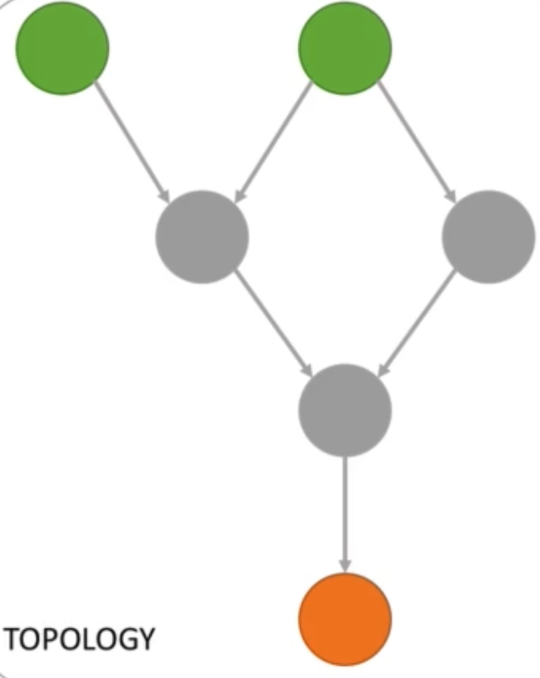

# Kafka Streams a nice introduction

In this repo, I would like to introduce the Kafka streams through examples and some basic theories to get them. Obviously, before starting reading this repository I hope you have at least a basic knowledge of what Kafka is and how to perform basic operations.

How I suggest reading this repo:

1. READ What is written below.
2. Have a look at the repo "kstreams-and-ktables-theory" there is a basic introduction with explaination on the transformation and the difference between KTables and KStreams.
3. Go to the folder "word-count", try to solve it by yourself reading the Steps to perform (the code is well documented in case you need help as well as the README).
4. Folder "favourite-colour", try to solve it, this time without reading my code.
5. Some theory, the folder "exactly-once-semantics" introduces to you a common problem and the possible solutions.
6. In the folder "bank-balance" there is an exercise where you can apply what you learned at the previous point.
7. The last folder to read about is "globalKTable", you can find an exercise and a basic introduction to the theory necessary to perform the "join" operations.

**Credits**: All the material is coming from different resources on the web, it is partially edited to make it clear(at least for me). Most of the theory is coming from a nice course on Udemy that I suggest attending( [kafka streams course](https://www.udemy.com/course/kafka-streams)) and from the confluent documentation.

## Kafka Streams Application Terminology

- A '**Stream**' is a sequence of immutable data records, that fully ordered, can be replayed, and this process is fault tolerant.

- A '**Stream processor**' is a node in the processor topology (graph). It transforms incoming streams, record by record, and may create a new stream from it (but can't change the stream, because it is immutable).

- A '**topology**' is a graph of processors chained together by streams.

  <p align="center">
    
  </p>

  

- A '<span style="color:green">**Source processor(green)**'</span> is a special processor that takes its data directly from a Kafka Topic. It has no predecessors in a topology, and doesn't transform the data.

- A '<span style="color:orange">**Sink processor (orange)**</span>' is a processor that does not have children, it sends the stream data directly to a Kafka topic.

<p align="center"></p>


## Streams App Properties

- A stream application, when communicating to Kafka, is leveraging the Consumer and Producer API.
- bootstrap.servers: need to connect to kafka (usually port 9092).
- auto.offset.reset.config: set to 'earliest' to consume the topic from start.
- application.id: specific to Streams application, will be used for:
  - ​	Consumer group.id = application.id (most important one to remember).
  - ​    Default client.id prefix.
  - ​    Prefix to internal changelog topics.
- default.[key| value].serde (for Serialization and Deserialization of data).

## Java 8 Lambda Functions

- **Java 7**: What you used to write when passing a function:

  ```java
  stream.filter(new Predicate<String, Long> () {
    	@Override
  		public boolean test(String key, long value) {
  			 return value > 0;
  		}
  });
  ```

- **Java 8**: Can now be written as an anonymous lambda function:

  ```java
  stream.filter((key, value) -> value > 0);
  ```

  The types of key and value are inferred at compile time.

  More Info at: [w3schools java lambda](https://www.w3schools.com/java/java_lambda.asp)

  