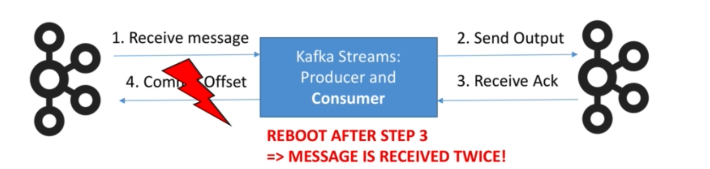
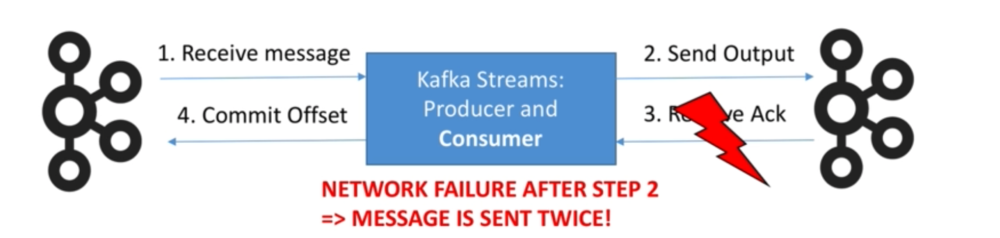

# Exactly once semantics

Exactly once in Kafka is the ability to guarantee that data processing on each message will happen only once, and that pushing the message back to Kafka will also happen effectively only once (Kafka will de-dup). **It is guaranteed when both input and output system is Kafka, not for Kafka to any external system**. You can only get exactly once semantic if your kafka brokers are of version >= 0.11 and your kafka streams client is of version >= 0.11.

## When does the problem arise?

- Case 1:



​		**As a Kafka Consumer (at least once): You receive twice the same message if the Kafka broker reboots or your Kafka consumer restarts. This 	          	    is because offsets are committed once in a while, but the data may have been processed already.**

- Case 2:

  

​	  **As a Kafka Producer: You send twice the same message to Kafka if you don't receive an ack back from Kafka (because of the retry logic). But not      	  receiving an ack does not mean kafka hasn't received your message. It may mean that the network just failed to deliver it.**

## How Kafka solves the problem?

- **The producers are now idempotent (if the same message is sent twice or more due to retries, Kafka will make sure to only keep one copy of it)**.

- **You can write multiple messages to different kafka topics as part of one transaction (either all are written, or none is written)**.

All those features are used behind the scenes by Kafka Streams, you don't have to implement any extra logic, just specify that you want to achieve exactly once semantic in the properties.

```java
Properties props = new Properties();
...
props.put(StreamsConfig.PROCESSING_GUARANTEE_CONFIG, streamsConfig.EXACTLY_ONCE);
...
KafkaStreams streams = new KafkaStreams(builder, props);
```

**Why do we not implement it everywhere?** **Results are published in transactions -> more latency , based on the banchmarks can be 10%/20% more (you can tune that setting using "commit.interval.ms").**

