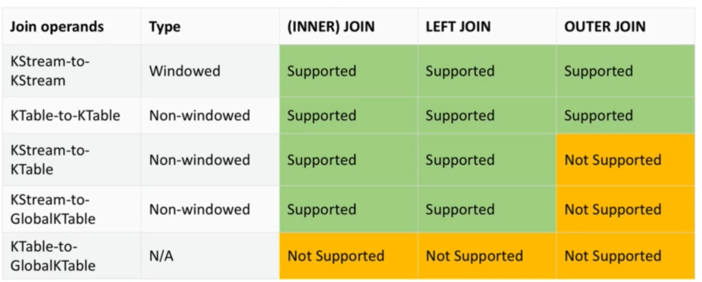

# GlobalKTable

## What's a join

Joining means taking a KStream and/ or a KTable and creating a new KStream or KTable from it. There are 4 kind of joins (SQL-like). "**Windowed**" operation does it means that it happens in a specific time frame, otherwise will do the join for all the new stream traffic coming, and maybe we just need it for a specific time-frame.




## Joins constraints Co-partitioning of data

These 3 joins:

- KStream/ KStream
- KTable/ KTable
- KStream/ KTable

Can only happen when the data is co-partitioned. Otherwise the join won't be doable and Kafka Streams will fail with a Runtime Error. That means that the same number of partitions is there on the stream and/ or the table. (because the data is living partially to each stream application based on what partition the stream application is reading). To co-partition data, if the number of partitions is  different, write back to topics through Kafka before join. This has a network cost.

## Joins GlobalKTable

To solve the previous problem. If your KTable data is reasonably small, and can fit on each of your Kafka Streams application, you can read it is a GlobalKTable. With GlobalKTable, you can join any stream to your table even if the data doesn't have the same number of partition. That's because the table data lives on every Streams application instance. The downside is size on disk, but that's okay for reasonably sized dataset.

## Application

Join User Purchases (KStream), potentially user purchases are unlimited, to User Data(GlobalKTable), the user usually are limited, if the user data is too big to fit a table, then GlobalKTable is not a good fit, because there will be a copy in each kafka streams application,

Steps:

1. Read one topic from Kafka (KStream).
2. Read the other topic from Kafka (GlobalKTable).
3. Inner join.
4. Write to Kafka the result of the inner join.
5. Left Join.
6. Write to Kafka the result of the left join.

## How to run it

```bash
#!/bin/bash
# download kafka, extract kafka in a folder and go in it

# open a shell - zookeeper is at localhost:2181
bin/zookeeper-server-start.sh config/zookeeper.properties

# open another shell - kafka is at localhost:9092
bin/kafka-server-start.sh config/server.properties


# create input topic for user purchases
bin/kafka-topics.sh --create --zookeeper localhost:2181 --replication-factor 1 --partitions 3 --topic user-purchases

# create table of user information - log compacted for optimisation
bin/kafka-topics.sh --create --zookeeper localhost:2181 --replication-factor 1 --partitions 2 --topic user-table --config cleanup.policy=compact

# create out topic for user purchases enriched with user data (left join)
bin/kafka-topics.sh --create --zookeeper localhost:2181 --replication-factor 1 --partitions 3 --topic user-purchases-enriched-left-join

# create out topic for user purchases enriched with user data (inner join)
bin/kafka-topics.sh --create --zookeeper localhost:2181 --replication-factor 1 --partitions 3 --topic user-purchases-enriched-inner-join

# start a consumer on the output topic (left join)
bin/kafka-console-consumer.sh --bootstrap-server localhost:9092 \
    --topic user-purchases-enriched-left-join \
    --from-beginning \
    --formatter kafka.tools.DefaultMessageFormatter \
    --property print.key=true \
    --property print.value=true \
    --property key.deserializer=org.apache.kafka.common.serialization.StringDeserializer \
    --property value.deserializer=org.apache.kafka.common.serialization.StringDeserializer


# start a consumer on the output topic (inner join)
bin/kafka-console-consumer.sh --bootstrap-server localhost:9092 \
    --topic user-purchases-enriched-inner-join \
    --from-beginning \
    --formatter kafka.tools.DefaultMessageFormatter \
    --property print.key=true \
    --property print.value=true \
    --property key.deserializer=org.apache.kafka.common.serialization.StringDeserializer \
    --property value.deserializer=org.apache.kafka.common.serialization.StringDeserializer


```

## 