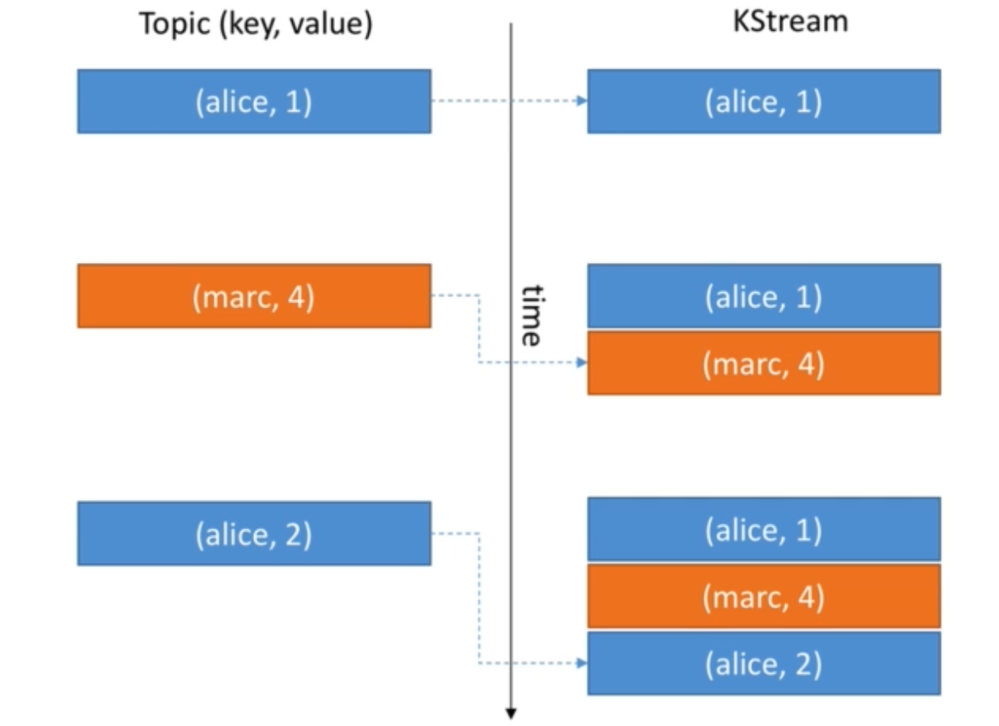
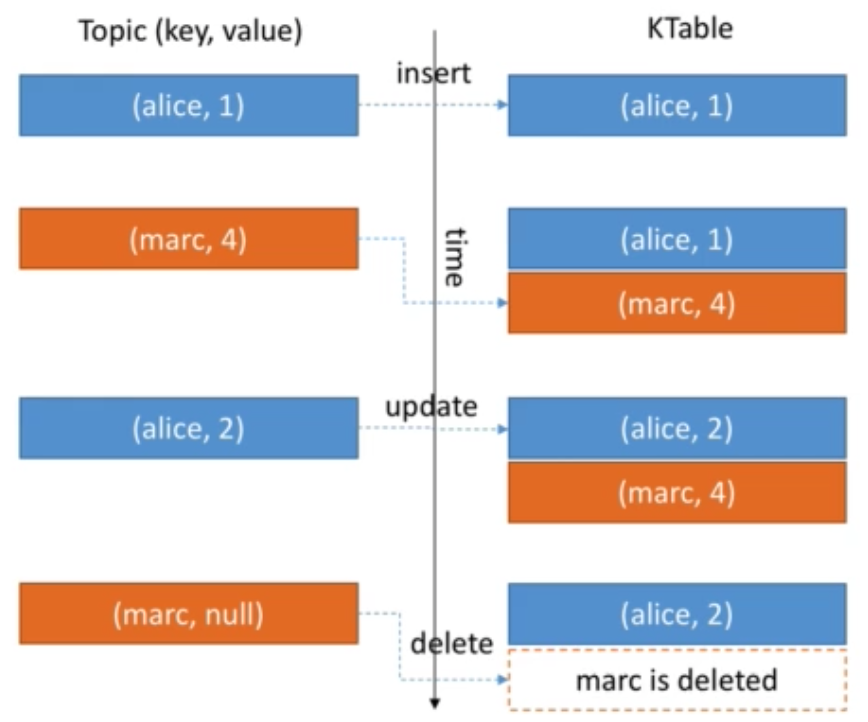
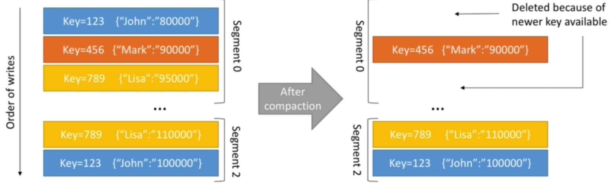
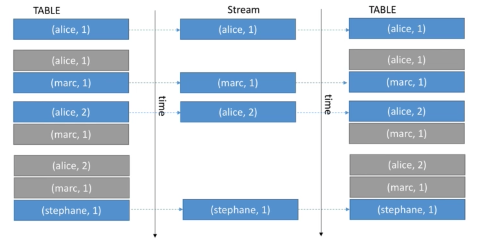

# KStreams-and-KTables Simple Operations 

## KStreams

- All inserts
- Similar to a log, order sequence of messages.
- Unbounded data streams (no ends, always expecting more data to come).




## KTables

- All upserts on non null values (To insert rows into a database table if they do not already exist, or update them if they do).
- Deletes on null values.
- Similar to a table (acts more like a database table).
- Prallel with log compacted topics.




## When to use KStream vs KTable ?

- KStream reading from a topic that's not compacted.
- KTable reading from a topic that's log-compacted (aggregations).
- KStream if new data is partial information/ transactional.
- KTable more if you need a structure that's like a "database table", where every update is self succifient.

## Stateless vs Stateful Operations

- **Stateless** means that the result of a transformation only depends on the data-point you process. E.g. : a "multiply value by 2" operation is stateless because id doesn't need memory of the past to be achieved. 1 => 2 and 300 => 600.
- **Stateful** means that the result of a transformation also depends on an external information - the **state**. E.g. :  a count operation is stateful because your app needs to know what happened since it started running in order to know the computation result. hello => 1, hello => 2.

## Transformations

### MapValues/ Map

Takes one record and produces one record **(1 -> 1)**.

- MapValues: 
  - Is only affecting values.
  - Does not change keys consequentially does not trigger a repartition.
  - For KStreams and KTables.
- Map
  - Affects both keys and values.
  - Triggers a re-partitions (because change the key).
  - For KStreams only.

E.g. 

```java
// change the values arriving from the stream to upper case.
// e.g. (1, hello) -> (1, HELLO)
uppercased = stream.mapValues( value -> value.toUpperCase());
```

### Filter/ FilterNot

Takes one record and produces zero or one record **(1 -> 0/ 1)**.

- Filter
  - Does not change keys or values, so does not trigger a repartition.
  - For KStreams and KTables.
- FilterNot
  - Inverse of Filter, consist of records which do not satisfy the given predicate.

E.g. 

```java
// A filter that selects only positive numbers.
// e.g. (key1, 2) -> (key1, 2), (key1, -2) -> record deleted
KStream<String, Long> onlyPositives = stream.filter((key, value) -> value > 0);
```

### FlatMapValues/ FlatMap

Takes one record and produces zero, one or more record **(1 -> 0/1/ ...)**. **Note**: The output of FlatMapValues/ FlatMap has to be a List.

- FlatMapValues
  - Does not change key, so does not trigger a repartition.
  - For KStreams only.
- FlatMap
  - Changes keys.
  - Triggers a repartitions.
  - For KStreams only.

E.g. 

```java
// Split a sentence into words.
// e.g. (1, world is over) -> (1, world), (1, is), (1, over) 
words = sentences.flatMapValues(value -> Arrays.asList(value.split("\\s+")));
```

### KStream Branch

Branch (split) a KStream based on one or more predicates. 

- Predicates are evaluated in order, if no matches, records are dropped.
- You get multiple KStreams as a result, each with different records. 

E.g. 

```java
BranchedKStream<String, Long>branches = stream.split()
.branch((key, value) -> value > 100) /* first predicate, if the value is greater than 100, is going in this branch, otherwise valuates the second predicate */
.branch((key, value) -> value > 10) // second predicate
.branch((key, value) -> value > 0 )// third predicate
);
```


### KStream SelectKey

Assign a new Key to the record (from old key and value), so marks the data for re-partitioning.

E.g. 

```java
// Use the first letter of the key as the new key
// e.g. (key1, world) -> (k, world)
rekeyed = stream.selectKey((key, value) -> key.substring(0,1));
```

### 

## KStream & KTable, Reading from Kafka

You can read a topic as a KStream, a KTable or a GlobalKTable

- As a KStream: 

  ```java
  KStream<String, Long> wordCounts = builder.stream("word-counts-input-topic" /* input topic */);
  ```

- As a KTable: 

  ```java
  KTable<String, Long> wordCounts = builder.table("word-counts-input-topic" /* input topic */);
  ```

- As a GlobalKTable: 

  ```java
  GlobalKTable<String, Long> wordCounts = builder.globalTable("my-stream-input-topic" /* input topic */);
  ```

  

## KStream & KTable, Writing to Kafka

You can write any KStream or KTable back to Kafka. **Note**: If you write a KTable back to Kafka, think about creating a log compacted log.

- 'To' operation: Terminal operation - write the records to a topic. 

  ```java
  stream.to("my-stream-output-topic");
  table.to("my-table-output-topic");
  ```

- 'Through': write to a topic and get a stream/ table back from the topic. It is useful when you wanna create new topics and perform new transformations but save a middle-transformation to a topic.

  ```java
  KStream<<String, Long> newStream = stream.through("my-stream-output-topic");
  KTable<<String, Long> newTable = table.through("my-table-output-topic");
  ```

## Streams Marked for Re-Partition

As soon as an operation can possibly change the key, the stream will be marked for a repartition (e.g. Map transformation, FlatMap etc...). So only use the APIs that change the keys if you need it, otherwise use their counterparts. Because repartitioning is done seamlessly behind the scenes but will incur a performance cost (read and write to Kafka).

## Log Compaction

- Log compaction can be a huge improvement in performance when dealing with KTables because eventually records get discarded. This means less reads to get to the final state (less time to recover).

- Log compaction has to be enabled by you on the topics that get created (source or sink topics).

### Log Cleanup Policy: Compact

- Log compaction ensures that your log contains at least the last know value for a specific key within a partition.
- Very useful if we just require a SNAPSHOT instead of full history (such as for a data table in a database).
- The idea is that we only keep the latest "update" for a key in our log.

E.g.: Our topic is: employee-salary, we want to keep the most recent salary for our employees.



### Log Compaction Guarantees

- Any consumer that is reading from the head of a log, will still see all the messages sent to the topic.
- Ordering of messages is kept, log compaction only removes some messages, but does not re-order them.
- The offset of a message is immutable (it never changes). Offsets are just skipped if a message is missing.
- Deleted records can still be seen by consumers for a period of delete.retention.ms (default is 24 hours).
- It doesn't prevent you from pushing duplicate data to Kafka: de-duplication (key-compaction) is done after a segment is committed, therefore the consumers that consume from the topic, will see the records as soon as they arrive, there is no de-duplication involved from the producer side. **Log compaction is only for new consumers, that they do not have to read the entire topic to arrive at final state. It doesn't work for consumers that have already being reading, because they read from the head of a log.**
- **Log Compaction can fail from time to time. It is an optimization and the compaction thread might crash. Make sure you assign enough memory to it and that it gets triggered**.

## KStream & KTable Duality 

- Stream as Table: A stream can be considered a changelog of a table, where each data record in the stream captures a state change of the table.
- Table as Stream: A table can be considered a snapshot, at specific point in time, of the latest value for each key in a stream (a stream's data records are key-value pairs).



It is sometimes helpful to transform a KTable to a KStream in order to keep a changelog of all the changes to the KTable:

```java
KTable<byte[], String> table = ...;
KStream<byte[], String> stream = table.toStream();
```

To transform a KStream to a KTable:

- Aggregation step

```java
KTable<String, Long> table = usersAndColours.groupByKey().count();
```

- Write back to Kafka and read as KTable (intermediary topic with network cost):

```java
// write to Kafka
stream.to("intermediary-topic");

//read from Kafka as a table
KTable<String, String> table = builder.table("intermediary-topic");
```

### KTable GroupBy

GroupBy allows you to perform more aggregations within a KTable. It triggers a repartition because the key changes.

```java
// Group the table by a new key and key type
KGrupedTable<String, Integer> groupedTable = table.groupBy(
(key, value) -> KeyValue.pair(value, value.length()),
Serdes.String(),
Serdes.Integer());
```

## KGroupedStream/ KGroupedTable count

As a reminder, KGroupedStream are obtained after a 'groupBy/ groupByKey()' call on a KStream.

Count counts the number of record by grouped key.

- If used on KGroupedStream: null keys or values are ignored.
- If used on KGroupedTable:
  - Null keys are ignored.
  - Null values are treated as 'delete' (tombstones).

## KGroupedStream Aggregate

You need an initializer (of any type), an adder, a Serde and a state store name (name of your aggregation). E.g. Count total String length by key.

```java
// Aggregating a KGroupedStream (note how the value type changes from String to Long)
KTable<byte[], Long> aggregatedStream = groupedStream.aggregate(
() -> 0L, //initializer, the first Value when we start the aggregate is 0
(aggKey, newValue, aggValue) -> aggValue + newValue.length(),//adder, aggValue is the current value and we sum the new value length coming from the stream
Serdes.Long(),//serde for aggregate type value
"aggregated-stream-store"//state store name
);
```

## KGroupedTable Aggregate

You need an initializer (of any type), an adder, a <u>subtractor</u> (because data from KTable can be deleted and we need to know what operation to perfrom what this happen), a Serde and a State Store name (name of your aggregation). E.g. Count total String length by key.

```java
// Aggregating a KGroupedStream (note how the value type changes from String to Long)
KTable<byte[], Long> aggregatedStream = groupedStream.aggregate(
() -> 0L, //initializer, the first Value when we start the aggregate is 0
(aggKey, newValue, aggValue) -> aggValue + newValue.length(),//adder, aggValue is the current value and we sum the new value length coming from the stream,
(aggKey, oldValue, aggValue) -> aggValue -oldValue.length(),//subtractor, aggValue is the current value and we subtract the new old value length, because it has been removed. 
Serdes.Long(),//serde for aggregate type value
"aggregated-stream-store"//state store name
);
```

## KGroupedStream/ KGroupedTable Reduce

It is a simplified version of the aggregate transformation. It is similar to Aggregate, but the result type has to be the same as the input (Int, Int => Int, can't be a Long for example).

E.g.

```java
KTable<String, Long> aggregatedStream = groupedStream.reduce(
(aggValue, newValue) -> aggValue + newValue.length(),
"reduced-stream-store"
);
```

```java
KTable<String, Long> aggregatedStream = groupedTable.reduce(
(aggValue, newValue) -> aggValue + newValue,
(aggValue, oldValue) -> aggValuie - oldValue.length(),
"reduced-stream-store"
);
```

## KStream Peek

Peek allows you to apply a side-effect (modify an external element but not the Stream itself) operation to a KStream and get the same KStream as a result. A side-effect could be for instance printing the stream to the console or statistics collection. 

**Note**: It could be executed multiple (in case of failure), times as it is side effect, can lead to duplicate messages. 

E.g.

```java
KStream<byte[], String> stream = ...;
KStream<byte[], String> unmodifiedStream = stream.peek( (key,value) -> System.out.println('key='+ key + ", value=" + value));
```

