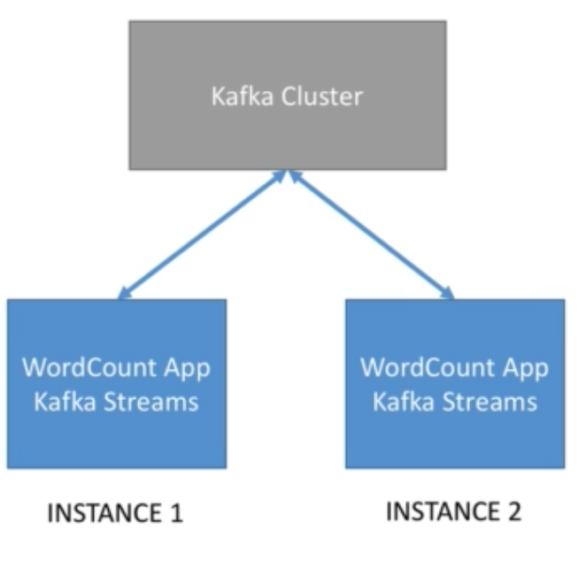
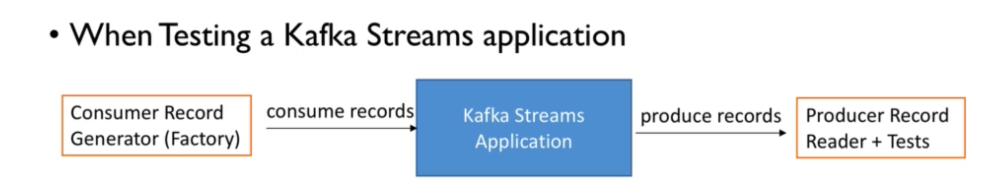

# WordCount Streams App

**STEPS** (for the code go to WordCountApp.java):

1. Stream from Kafka.  

   ​	*< null, "hey Hey LOVE">*

2. "**MapValues**" lowercase ( we want all the words to be in lowercase).  

   ​	*<null,  "hey hey love">*

3. "**FlatMapValues**" split by space. 

   ​	 *<null, "hey">, <null, "hey">, <null, "love">*

4. "**SelectKey**" to apply a key (replace the key of the message, and we want the key to be equal to the value).

   ​	 *<"hey", "hey">, <"hey", "hey">, <"hey", "love">*

5. "**GroupByKey**" before aggregation (because before we defined the key as value, there are going to be sets with all the same word). 

   ​	*(<"hey", "hey">, <"hey", "hey">), ( <"hey", "love"> )*

6. "**Count**" occurences in each group. 

   ​	*<"hey", 2>, <"love", 1>*

7. "**To**" in order to write the result back to kafka.

## Topology

- Let's write the topology using the High Level DSL.

- Remember data in Kafka Streams is < Key, Value >

- Printing the topology at the start of the application is helpful while developing ( and even in production)  at it helps understand the application flow directly from the first lines of the logs. Reminder: The topology represents all the streams and processors of your Streams application:

  ```java
  KafkaStreams streams = new KafkaStreams(builder, props);
  
  streams.start();
  
  System.out.println( streams.toString() );
  ```

  

## Closing the application gracefully

- Adding a shutdown hook is the key to allow for a graceful shutdown of the Kafka Streams application, which will help the speed of restarting.
- This should be in every Kafka Streams application you create.

```java
// Add shutdown hook to stop the Kafka Streams threads.
// You can optionally provide a timeout to 'close'
Runtime.getRuntime().addShutdownHook(new Thread(streams::close));
```


## How to run it?

```bash
#!/bin/bash
# download kafka, extract kafka in a folder and go in it

# open a shell - zookeeper is at localhost:2181
bin/zookeeper-server-start.sh config/zookeeper.properties

# open another shell - kafka is at localhost:9092
bin/kafka-server-start.sh config/server.properties

# create input topic with two partitions
bin/kafka-topics.sh --create --zookeeper localhost:2181 --replication-factor 1 --partitions 2 --topic word-count-input

# create output topic
bin/kafka-topics.sh --create --zookeeper localhost:2181 --replication-factor 1 --partitions 2 --topic word-count-output

# launch a Kafka consumer
bin/kafka-console-consumer.sh --bootstrap-server localhost:9092 \
    --topic word-count-output \
    --from-beginning \
    --formatter kafka.tools.DefaultMessageFormatter \
    --property print.key=true \
    --property print.value=true \
    --property key.deserializer=org.apache.kafka.common.serialization.StringDeserializer \
    --property value.deserializer=org.apache.kafka.common.serialization.LongDeserializer

# launch the streams application

# then produce data to it
bin/kafka-console-producer.sh --broker-list localhost:9092 --topic word-count-input

# package your application as a fat jar
mvn clean package

# run your fat jar
java -jar <your jar here>.jar

# list all topics that we have in Kafka (so we can observe the internal topics)
bin/kafka-topics.sh --list --zookeeper localhost:2181

```

## Internal Topics

- Running a Kafka Streams may eventually create internal intermediary topics.
- Two types:
  - Repartitioning topics: in case you start transforming the key of your stream, a repartitioning will happen at some processor.
  - Cahngelog topics: in case you perform aggregations, Kafka Streams will save compacted data in these topics.
- Internal topics:
  -  Are managed by Kafka Streams.
  - Are used by Kafka Streams to save/ restore and re-partition data.
  - Are prefixed by application.id parameter.
  - They should never be deleted, altered or published to (manually).

## Packaging the application as fat jar

- In order to deploy the application to other machines, we often need to compile it as .jar (java Archive).
- Default compilation in java only includes the code you write in the .jar file, without the dependencies. 
- Maven has a plugin to allow us to package all our code + the dependencies into one jar, simply called a '**fat jar**'.

## Scale WordCount Streams

**Our input topic has 2 partitions, therefore we can launch up to 2 instances of our application in parallel without any changes in the code. This is because a Kafka Streams application relies on Kafka Consumer,** and we know that we can add consumers to a consumer group (application.id) by just running the same code (but just one consumer for partition!). **This makes scaling super easy, without the need of any application cluster (just run the jar over and over again).**



## Testing a Kafka Streams Application

We can write test from the version 1.1 of Kafka, without the need of run the kafka ecosystem separately.



Test cases:

- Case 1: Ensure that word count works while pushing multiple records:
  - We'll push "testing Kafka Streams" and ensure the counts are correct.
  - We'll push "testing Kafka again" and esure the counts are correct.
- Case 2: Ensure that word count does count by using lowercase words:
  - We'll push "KAFKA kafka Kafka" and ensure the counts are correct.
  - We'll make sure the count is for the key "kafka".
